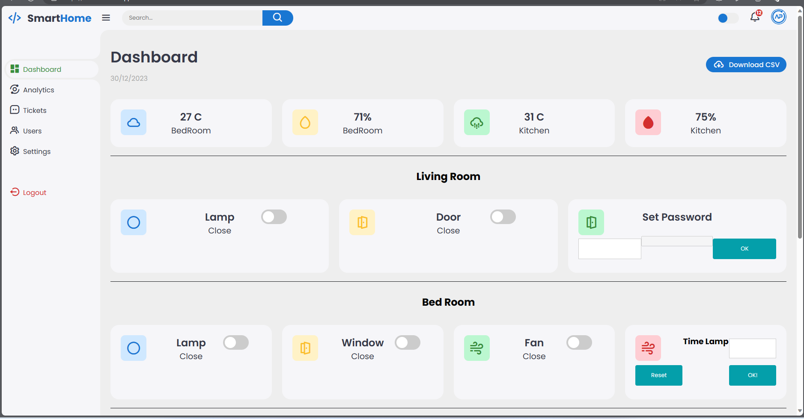

# Smart_Home

Mô hình sử dụng 2 esp8266. Mỗi esp8266 được cấu hình riêng phục vụ cho các chức năng trong các phòng khác nhau. ESP8266_1 phục vụ cho bật tắt đèn, đọc tín hiệu sensor. ESP8266_2 phục vụ cho việc đóng mở cửa.

Mô hình sử dụng công nghệ MQTT và Firebase để điều khiển thiết bị nhằm nhận được thời gian phản hồi nhanh nhất.

Code được nằm trong ESP866_1_BEDROOM_KITCHEN (do lỗi upload nên file code được upload dưới dạng .zip) và ESP8266_2. 

Code giao diện web nằm trong folder Firebase.

Link website: https://tkllhk231.web.app/

